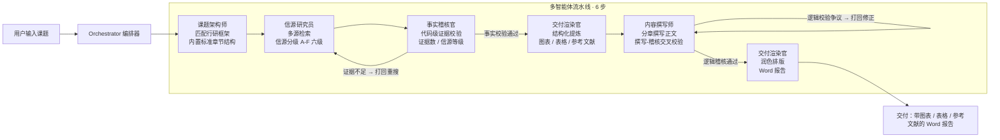
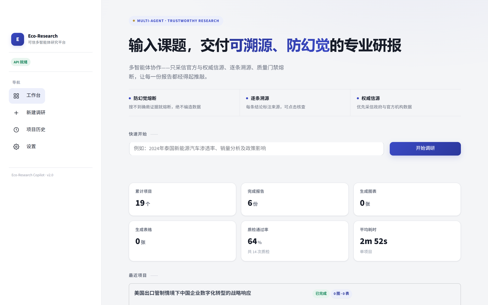
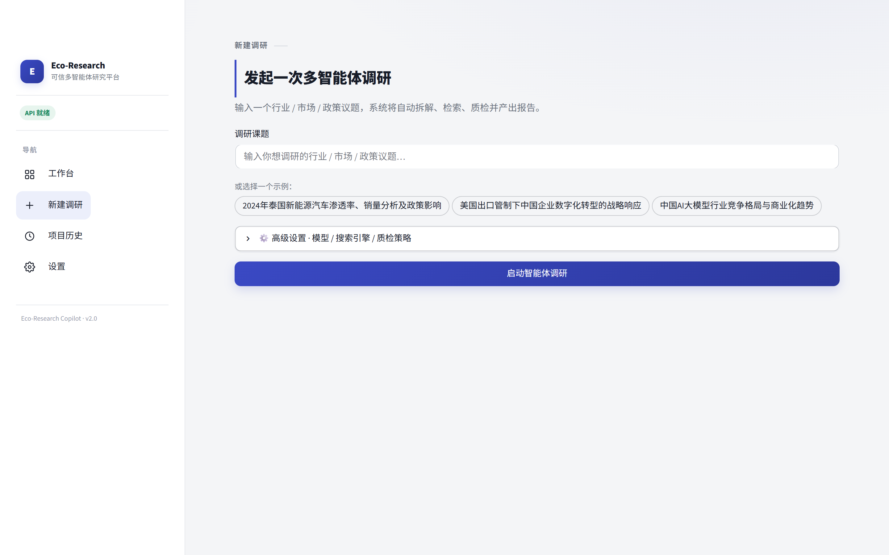
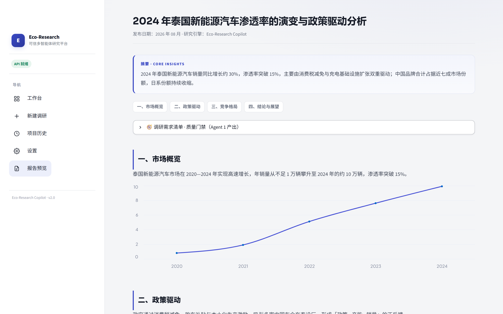

# Eco-Research Copilot · 框架驱动的可信研究工具

> 以**行业框架约束输出结构、以代码校验证据**的可信研究工具——输入课题，自动产出带图表、逐条可溯源的深度研报（Word）。

面向投研 / 咨询 / 战略分析场景：把「手动查资料 + 写报告」压缩成一次对话。

---

## 核心亮点

| 亮点 | 说明 |
|------|------|
| **行研框架引擎** | 内置新能源 / TMT / 大消费等行业共识框架，输出结构不靠模型自由发挥，专业度有保障 |
| **代码级证据校验** | 每章证据数达标 + 核心指标信源等级门槛 + 数值矛盾标红，由代码判定，不靠模型自评 |
| **证据溯源面板** | 每条结论绑定信源等级 / 机构 / 原文摘录 / 链接，报告页逐条核查，矛盾数据标红提示 |
| **A-F 六级信源评级** | 借鉴 Admiralty 双维度，区分官方 / 权威媒体 / 行业专业 / 一般 / 低质 / 无法判断 |
| **多智能体协作** | 课题架构师 / 信源研究员 / 事实稽核官 / 内容撰写师 / 交付渲染官 各司其职，Orchestrator 统一编排 |

## 设计取舍

| 决策 | 选择 | 理由 |
|------|------|------|
| **交互形态** | Streamlit **Web 工作台**，而非 CLI | 面向投研 / 咨询 / 战略等非技术用户，核心体验是「输入课题 → 拿到可溯源报告」，而非「跑一条命令」 |
| **编排模式** | 闭环迭代 + **人机协同**，而非线性状态机 | 任务状态与中间产物全量持久化，支持**运行中暂停 → 查看 / 编辑中间产物 → 从下游继续**——比「Ctrl+C 断点恢复」多了「人在环」的产品维度 |
| **防幻觉** | **代码级证据校验**，而非模型自评 | 证据落成强类型契约，代码查「每章证据数 + 信源等级 + 数值矛盾」，模型想编数据在数据结构层就被拒 |
| **容错** | 分级降级（备用模型 / 搜索兜底 / 渲染降级） | 单点失败不中断全链路：主模型挂了切备用，搜索挂了用内置框架兜底，渲染挂了降级输出 Markdown |
| **交付物** | Word（正式）+ Markdown（中间态 / 兜底） | Word 便于直接交付，Markdown 保留可复用的结构化中间态 |

## 路线图

已完成的核心能力之外，两条规划中的方向：

| 方向 | 定位 |
|------|------|
| **行业指标知识库**（规划中） | 每次报告跑完后，把通过归一化校验的有效指标自动沉淀到对应行业知识库（时间/来源/数值），下次同行业研究自动调历史数据做交叉验证 |
| **多主体横向对比**（规划中） | 支持同时输入多个公司/细分赛道，按统一框架生成横向对比报告，逐项对比核心指标与竞争地位 |

## 系统架构



## 多智能体协作流程

| 阶段 | Agent | 职责 | 关键产出 |
|------|-------|------|---------|
| 1. 架构 | **课题架构师** | 匹配内置行研框架（新能源/TMT/消费），生成标准章节 + 每章证据要求，LLM 仅微调 | `research_requirements` |
| 2. 检索 | **信源研究员** | 多源检索（Tavily / DuckDuckGo），给每条信源打 A-F 六级等级（借鉴 Admiralty 双维度） | 带评级的原始素材 |
| 3. 稽核 | **事实稽核官** | 代码级证据校验：LLM 提炼证据到强类型契约，代码查每章证据数 / 信源等级 / 数值矛盾 | `verified_context` + `evidence` |
| 4. 提炼 | **交付渲染官** | 结构化提炼：标题 / 摘要 / 大纲 / 图表 / 表格 / 参考文献 | `structure` |
| 5. 撰写 | **内容撰写师** | 分章撰写正文，与逻辑稽核交叉校验（撰写-稽核辩论） | `markdown_report` |
| 6. 渲染 | **交付渲染官** | 文字润色 + 排版，生成学术格式 Word 文档 | `05_final_report.docx` |

## 证据校验与防幻觉

大模型会「一本正经地编数据」。本项目的解法是在**生成正文前**加一道代码校验闸门：

1. 课题架构师 先匹配**内置行研框架**（行业概览/产业链/竞争格局/政策环境/趋势研判），每章带必答问题 + 证据要求 + 信源等级门槛；
2. 信源研究员 检索并给每条信源打 A-F 六级等级（A 官方 / B 权威媒体 / C 行业专业 / D 一般 / E 低质 / F 无法判断）→ 事实稽核官 用代码做**证据校验**（每章证据数达标 + 核心指标 A/B/C 级支撑 + 矛盾标红），形成**检索-稽核内循环**（多轮迭代，可配置）；
3. 结构化提炼 + 正文撰写后，事实稽核官 再做**逻辑校验**（论据溯源 + 逻辑矛盾排查），争议打回重写，形成**撰写-稽核交叉校验内循环**；
4. 若重试耗尽仍无确凿证据且开启严格模式，系统**强制熔断**，宁可失败也不编造。

> 校验结果由**代码**给出，模型输出无法改写结论——只有证据真正满足框架的章节要求才放行。
> 报告页的「证据溯源」面板可逐条核查每条结论的信源原文，矛盾数据自动标红。

## 界面预览

| 工作台 | 新建调研 | 报告预览 |
|:---:|:---:|:---:|
|  |  |  |

## 快速开始

### 环境要求
- Python 3.10+
- 一个兼容 OpenAI 协议的 LLM 网关（默认使用 DeepSeek）

### 安装
```bash
git clone https://github.com/yuyu-0808/eco-research-copilot
cd eco-research-copilot
pip install -r requirements.txt
```

### 配置
```bash
cp .env.example .env
# 编辑 .env，填入 DEEPSEEK_API_KEY 与 TAVILY_API_KEY
```

| 环境变量 | 必填 | 说明 |
|---------|:---:|------|
| `DEEPSEEK_API_KEY` | 必填 | LLM API Key |
| `BASE_URL` | — | API 网关地址，默认官方 `https://api.deepseek.com` |
| `MODEL_NAME` | — | 模型名，默认 `deepseek-chat` |
| `BACKUP_MODEL` | — | 备用模型，主模型重试耗尽后自动切换降级（留空不启用） |
| `SEARCH_PROVIDER` | — | `tavily`（推荐）/ `ddg`（可选代理） |
| `TAVILY_API_KEY` | 必填 | 使用 Tavily 搜索时必填 |
| `DDG_PROXY` | — | 使用 ddg 时的可选代理，如 `http://127.0.0.1:7890` |
| `MAX_COLLECT_ROUNDS` | — | 检索-稽核循环最大轮数，默认 3 |
| `REQUIRE_STRICT_EVIDENCE` | — | 是否开启质量门禁熔断，默认 True |
| `REPORT_MODE` | — | `standard`（快）/ `deep`（分章，更充实） |
| `REVIEW_MODE` | — | `auto`（全自动）/ `manual`（三阶段人机确认：框架→素材→终稿） |

### 运行
```bash
streamlit run main.py
```
浏览器打开 `http://localhost:8501`，输入课题即可开始。

## 项目结构

```
eco-research-copilot/
├── main.py                  # Streamlit 前端（SaaS 风格界面 + 实时流水线可视化）
├── src/
│   ├── orchestrator.py      # 多智能体编排器（含检索-稽核内循环）
│   ├── agents/              # 五类专业行研角色
│   │   ├── architect.py      # 课题架构师（匹配行研框架）
│   │   ├── researcher.py     # 信源研究员（结构化采集 + 评级）
│   │   ├── auditor.py        # 事实稽核官（确定性校验 + 逻辑稽核）
│   │   ├── writer.py         # 内容撰写师
│   │   └── renderer.py       # 交付渲染官（结构化提炼 + 排版）
│   ├── tools/               # 工具层（web_search / docx_writer）
│   ├── ui/                  # 前端辅助（项目扫描 / 指标计算 / 图表渲染）
│   └── utils/               # 配置 / 日志 / LLM 调用工具
├── projects/                # 运行时产物（每次调研的日志 + Word 报告，已 gitignore）
├── .env.example             # 环境变量模板
└── requirements.txt
```

## License

[MIT](LICENSE)

---

**Eco-Research Copilot** — 让一份可溯源、防幻觉的深度研报，从「半天」变成「几分钟」。
