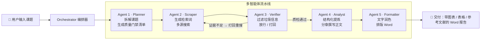

# Eco-Research Copilot · 多智能体投研报告工作台

> 输入一个研究课题，多个 AI Agent 协同完成「规划 → 采集 → **防幻觉质检** → 建模分析 → 排版交付」，自动输出一份**带图表、带参考文献溯源**的专业深度研报（Word）。

面向投研 / 咨询 / 战略分析场景：把「手动查资料 + 写报告」压缩成一次对话。

---

## ✨ 核心亮点

| 亮点 | 说明 |
|------|------|
| 🧠 **多智能体流水线** | Planner / Scraper / Verifier / Analyst / Formatter 各司其职，由 Orchestrator 统一编排 |
| 🛡 **防幻觉质量门禁** | 采集与质检形成内循环：搜不到「必答清单」要求的确凿证据就熔断，杜绝大模型编数据 |
| 🔗 **全链路可溯源** | 每条事实保留来源链接，报告参考文献可点击跳转，图表 / 表格由核验数据生成 |
| ⚡ **双模式报告** | standard（快，一次性生成）/ deep（分章生成，更充实、抗长文截断） |
| 🎛 **实时流水线可视化** | 前端实时展示各 Agent 的执行状态、质检轮次与滚动运行日志 |

## 🏗 系统架构



## 🔄 多智能体协作流程

| 阶段 | Agent | 职责 | 关键产出 |
|------|-------|------|---------|
| 1️⃣ 规划 | **Planner** | 拆解课题，定义 2–3 个「必答问题」作为质量门禁清单 | `research_requirements` |
| 2️⃣ 采集 | **Scraper** | 由 LLM 生成检索词（含 `site:` 权威源语法），Tavily / DuckDuckGo 多源搜索 | 原始素材 |
| 3️⃣ 质检 | **Verifier** | 从原始素材「淘金」：过滤垃圾信源，提炼高纯度事实并保留来源，判定放行 / 打回 | `verified_context` |
| 4️⃣ 分析 | **Analyst** | 结构化提炼（标题 / 摘要 / 大纲 / 图表 / 表格 / 参考文献），再分章撰写正文 | `ai_data` |
| 5️⃣ 排版 | **Formatter** | 文字润色（含图表占位符保护），生成学术格式 Word 文档 | `05_final_report.docx` |

## 🛡 防幻觉质量门禁（核心壁垒）

大模型会「一本正经地编数据」。本项目的解法是在**生成正文前**加一道确定性闸门：

1. Planner 先把课题拆解成 **2–3 个必须回答的核心问题**（质量门禁清单）；
2. Scraper 采集 → Verifier 质检，形成一个**内循环**（默认最多 3 轮）；
3. 只有当检索结果能满足清单要求（精确数据或权威定性信息），才放行进入分析阶段；
4. 若重试耗尽仍无确凿证据且开启严格模式，系统**强制熔断**，宁可失败也不编造。

> 质检采用「宽容的漏斗」策略：有权威定性信息即放行（并标注「精确数据待核实」），
> 只有素材「完全无用」才打回 —— 在「防幻觉」与「可用性」之间取得平衡。

## 🎨 界面预览

> 截图占位：`docs/screenshots/` 下放入界面截图后，替换下面三处。

| 工作台 | 新建调研 | 报告预览 |
|:---:|:---:|:---:|
|  |  |  |

## 🚀 快速开始

### 环境要求
- Python 3.10+
- 一个兼容 OpenAI 协议的 LLM 网关（默认使用 DeepSeek）

### 安装
```bash
git clone <your-repo-url>
cd eco-research-copilot
pip install -r requirements.txt
```

### 配置
```bash
cp .env.example .env
# 编辑 .env，填入 DEEPSEEK_API_KEY 与 TAVILY_API_KEY
```

| 环境变量 | 必填 | 说明 |
|---------|:---:|------|
| `DEEPSEEK_API_KEY` | ✅ | LLM API Key |
| `BASE_URL` | — | API 网关地址，默认 DeepSeek 兼容网关 |
| `MODEL_NAME` | — | 模型名，默认 `deepseek-v4-flash` |
| `SEARCH_PROVIDER` | — | `tavily`（推荐）/ `ddg`（本地代理） |
| `TAVILY_API_KEY` | ✅ | 使用 Tavily 搜索时必填 |
| `MAX_COLLECT_ROUNDS` | — | 采集-质检循环最大轮数，默认 3 |
| `REQUIRE_STRICT_EVIDENCE` | — | 是否开启质量门禁熔断，默认 True |
| `REPORT_MODE` | — | `standard`（快）/ `deep`（分章，更充实） |

### 运行
```bash
streamlit run main.py
```
浏览器打开 `http://localhost:8501`，输入课题即可开始。

## 📁 项目结构

```
eco-research-copilot/
├── main.py                  # Streamlit 前端（SaaS 风格界面 + 实时流水线可视化）
├── src/
│   ├── orchestrator.py      # 多智能体编排器（含采集-质检内循环）
│   ├── agents/              # 多智能体实现（各司其职）
│   │   ├── agent1_planner.py
│   │   ├── agent2_scraper.py
│   │   ├── agent3_verifier.py
│   │   ├── agent4_analyst.py
│   │   └── agent5_formatter.py
│   ├── tools/               # 工具层（web_search / docx_writer / data_cleaner）
│   ├── ui/                  # 前端辅助（项目扫描 / 指标计算 / 图表渲染）
│   └── utils/               # 配置 / 日志 / LLM 调用工具
├── tests/                   # 单元测试
├── projects/                # 运行时产物（每次调研的日志 + Word 报告，已 gitignore）
├── .env.example             # 环境变量模板
└── requirements.txt
```

## 🧪 测试

```bash
pytest tests/
```

## 📄 License

[MIT](LICENSE)

---

**Eco-Research Copilot** — 让一份可溯源、防幻觉的深度研报，从「半天」变成「几分钟」。
