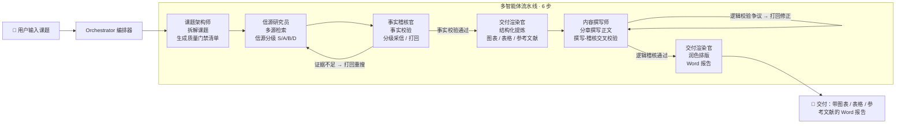

# Eco-Research Copilot · 多智能体投研报告工作台

> 输入一个研究课题，多个 AI Agent 协同完成「架构 → 检索 → **防幻觉稽核** → 建模撰写 → 渲染交付」，自动输出一份**带图表、带参考文献溯源**的专业深度研报（Word）。

面向投研 / 咨询 / 战略分析场景：把「手动查资料 + 写报告」压缩成一次对话。

---

## ✨ 核心亮点

| 亮点 | 说明 |
|------|------|
| 🧠 **多智能体流水线** | 课题架构师 / 信源研究员 / 事实稽核官 / 内容撰写师 / 交付渲染官 各司其职，由 Orchestrator 统一编排 |
| 🛡 **防幻觉质量门禁** | 检索与稽核形成内循环：搜不到「必答清单」要求的确凿证据就熔断，杜绝大模型编数据 |
| 🔗 **全链路可溯源** | 每条事实保留来源链接，报告参考文献可点击跳转，图表 / 表格由核验数据生成 |
| ⚡ **双模式报告** | standard（快，一次性生成）/ deep（分章生成，更充实、抗长文截断） |
| 🎛 **实时流水线可视化** | 前端实时展示各 Agent 的执行状态、稽核轮次与滚动运行日志 |

## 🎯 设计取舍（Design Rationale）

> 同类「多智能体投研」项目大多在堆工程复杂度（线性状态机、异常重试、断点续跑）。
> 本项目刻意选择了**产品化**路线：把「防幻觉」从一句口号，做成用户能感知、能干预的工作流。

| 决策 | 选择 | 理由 |
|------|------|------|
| **交互形态** | Streamlit **Web 工作台**，而非 CLI | 面向投研 / 咨询 / 战略等非技术用户，核心体验是「输入课题 → 拿到可溯源报告」，而非「跑一条命令」 |
| **编排模式** | 闭环迭代 + **人机协同**，而非线性状态机 | 任务状态与中间产物全量持久化，支持**运行中暂停 → 查看 / 编辑中间产物 → 从下游继续**——比「Ctrl+C 断点恢复」多了「人在环」的产品维度 |
| **防幻觉** | 质量门禁熔断 + **信源分级 S/A/B** | 只采信官方与权威信源；搜不到「必答清单」的确凿证据就熔断，宁可失败也不编造 |
| **容错** | 分级降级（备用模型 / 搜索兜底 / 渲染降级） | 单点失败不中断全链路：主模型挂了切备用，搜索挂了用内置框架兜底，渲染挂了降级输出 Markdown |
| **交付物** | Word（正式）+ Markdown（中间态 / 兜底） | Word 便于直接交付，Markdown 保留可复用的结构化中间态 |

**一句话：别人在做「更强的自动工具」，本项目在做「更可信、可干预的研究工作台」。**

## 🏗 系统架构



## 🔄 多智能体协作流程

| 阶段 | Agent | 职责 | 关键产出 |
|------|-------|------|---------|
| 1️⃣ 架构 | **课题架构师** | 拆解课题，定义 2–3 个「必答问题」作为质量门禁清单 | `research_requirements` |
| 2️⃣ 检索 | **信源研究员** | 多源检索（Tavily / DuckDuckGo），给每条信源打 S/A/B/D 等级 | 带评级的原始素材 |
| 3️⃣ 稽核 | **事实稽核官** | 事实校验：S/A 优先采信、B 谨慎、D 丢弃，提炼高纯度事实并保留来源 | `verified_context` |
| 4️⃣ 提炼 | **交付渲染官** | 结构化提炼：标题 / 摘要 / 大纲 / 图表 / 表格 / 参考文献 | `structure` |
| 5️⃣ 撰写 | **内容撰写师** | 分章撰写正文，与逻辑稽核交叉校验（撰写-稽核辩论） | `markdown_report` |
| 6️⃣ 渲染 | **交付渲染官** | 文字润色 + 排版，生成学术格式 Word 文档 | `05_final_report.docx` |

## 🛡 防幻觉质量门禁（核心壁垒）

大模型会「一本正经地编数据」。本项目的解法是在**生成正文前**加一道确定性闸门：

1. 课题架构师 先把课题拆解成 **2–3 个必须回答的核心问题**（质量门禁清单）；
2. 信源研究员 检索并给每条信源打 S/A/B/D 等级 → 事实稽核官 分级采信（S/A 优先、D 丢弃），形成**检索-稽核内循环**（默认最多 3 轮）；
3. 结构化提炼 + 正文撰写后，事实稽核官 再做**逻辑校验**（论据溯源 + 逻辑矛盾排查），争议打回重写，形成**撰写-稽核交叉校验内循环**；
4. 若重试耗尽仍无确凿证据且开启严格模式，系统**强制熔断**，宁可失败也不编造。

> 稽核采用「宽容的漏斗」策略：有权威定性信息即放行（并标注「精确数据待核实」），
> 只有素材「完全无用」才打回 —— 在「防幻觉」与「可用性」之间取得平衡。

## 🎨 界面预览

| 工作台 | 新建调研 | 报告预览 |
|:---:|:---:|:---:|
|  |  |  |

## 🚀 快速开始

### 环境要求
- Python 3.10+
- 一个兼容 OpenAI 协议的 LLM 网关（默认使用 DeepSeek）

### 安装
```bash
git clone <your-repo-url>
cd eco-research-copilot
pip install -r requirements.txt
```

### 配置
```bash
cp .env.example .env
# 编辑 .env，填入 DEEPSEEK_API_KEY 与 TAVILY_API_KEY
```

| 环境变量 | 必填 | 说明 |
|---------|:---:|------|
| `DEEPSEEK_API_KEY` | ✅ | LLM API Key |
| `BASE_URL` | — | API 网关地址，默认官方 `https://api.deepseek.com` |
| `MODEL_NAME` | — | 模型名，默认 `deepseek-chat` |
| `BACKUP_MODEL` | — | 备用模型，主模型重试耗尽后自动切换降级（留空不启用） |
| `SEARCH_PROVIDER` | — | `tavily`（推荐）/ `ddg`（可选代理） |
| `TAVILY_API_KEY` | ✅ | 使用 Tavily 搜索时必填 |
| `DDG_PROXY` | — | 使用 ddg 时的可选代理，如 `http://127.0.0.1:7890` |
| `MAX_COLLECT_ROUNDS` | — | 检索-稽核循环最大轮数，默认 3 |
| `REQUIRE_STRICT_EVIDENCE` | — | 是否开启质量门禁熔断，默认 True |
| `REPORT_MODE` | — | `standard`（快）/ `deep`（分章，更充实） |

### 运行
```bash
streamlit run main.py
```
浏览器打开 `http://localhost:8501`，输入课题即可开始。

## 📁 项目结构

```
eco-research-copilot/
├── main.py                  # Streamlit 前端（SaaS 风格界面 + 实时流水线可视化）
├── src/
│   ├── orchestrator.py      # 多智能体编排器（含检索-稽核内循环）
│   ├── agents/              # 多智能体实现（各司其职）
│   │   ├── agent1_planner.py
│   │   ├── agent2_scraper.py
│   │   ├── agent3_verifier.py
│   │   ├── agent4_analyst.py
│   │   └── agent5_formatter.py
│   ├── tools/               # 工具层（web_search / docx_writer / data_cleaner）
│   ├── ui/                  # 前端辅助（项目扫描 / 指标计算 / 图表渲染）
│   └── utils/               # 配置 / 日志 / LLM 调用工具
├── tests/                   # 单元测试
├── projects/                # 运行时产物（每次调研的日志 + Word 报告，已 gitignore）
├── .env.example             # 环境变量模板
└── requirements.txt
```

## 🧪 测试

```bash
pytest tests/
```

## 📄 License

[MIT](LICENSE)

---

**Eco-Research Copilot** — 让一份可溯源、防幻觉的深度研报，从「半天」变成「几分钟」。
